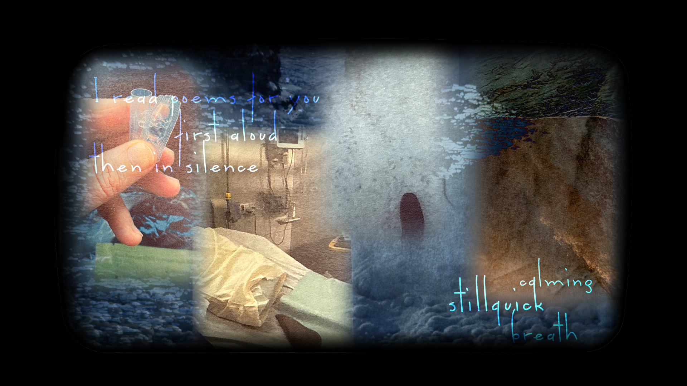

It's week two which means that everything in all of my classes begin to become real instead of a problem for future Michael. It also means that it's time to start conjuring up ideas for our capstone project, and luckily we were assigned one of my top choices for clients without having to rearrange group members. We are tasked with making a website as an extension for VK Preston's ongoing artwork, but it seems we've been given quite a bit of creative agency for our final product. Whenever this happens, I always get anxious about the scope and timeframe because ideas for expansion tend to pour into my brain and ever so rarely can I resist committing to them. This time is particularly scary because I have four other group members who are relying on me and each other, and I can hear the universe warning me about this semester's raging hurricane of coursework.

For the project itself, my personal vision is pretty vague (and probably will be for some time), but consists of a single page/scene with some or all of the works, blended together in a way that blurs the edges of the individual items and/or arranges them in a natural, non-uniform manner. Pushing heavily into the experimental and avant-garde, we want to create an experience that uses unconventional interaction paradigms to balance the presentation of the content as well as the website as a standalone piece. Since we're venturing into uncharted territory, I had very little luck in looking for references or inspiration from other web media, so I'm considering us pioneers in whatever genius new concepts we end up with. 

I've always wanted to work on an installation piece, but never had the opportunity nor the technical expertise to make something I'd feel happy putting my name on. I'm hoping that with this project possibly combining installations with web development, which I feel very comfortable with, I'll be able to carry over skills that I've already endured the treacherous process of acquiring. By the end of this project, I'm really praying to have completed a functioning website and not just a prototype.